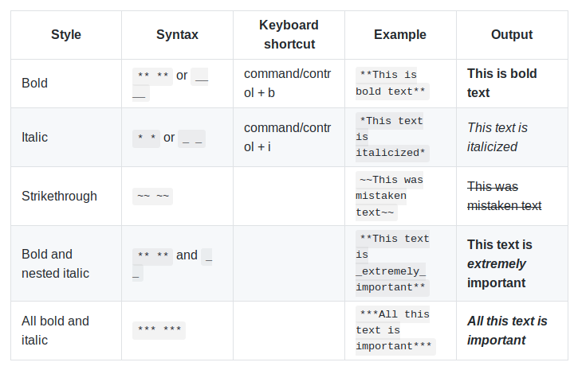

<h1>
    Basic writing and formatting syntax
</h1>
Create sophisticated formatting for your prose and code on GitHub with simple syntax. For more information: [Part 2](Part2.md) [Part 3](Part3.md) [Part 4](Part4.md)

<b>Part 1:</b> - [Headings](#Headings) - [Styling text](#Styling-text) - [Paragraphs and line breaks](#Paragraphs-and-line-breaks)

<h2>Headings</h2>

To create a <em>heading</em>, add one to six \# symbols before your heading text. The number of \# you use will determine the size of the heading.

<h1>The largest heading</h1>
<h2>The second largest heading</h2>
<h6>The smallest heading</h6>

<h2>Styling text</h2>

You can indicate emphasis with bold, italic, or strikethrough text. 

<h2>Paragraphs and line breaks</h2>

You can create a new <em>paragraph</em> by leaving a blank line between lines of text.

<h3>
    <a href="https://help.github.com/en/articles/basic-writing-and-formatting-syntax#ignoring-markdown-formatting">https://help.github.com/en/articles/basic-writing-and-formatting-syntax#ignoring-markdown-formatting</a>
</h3>

